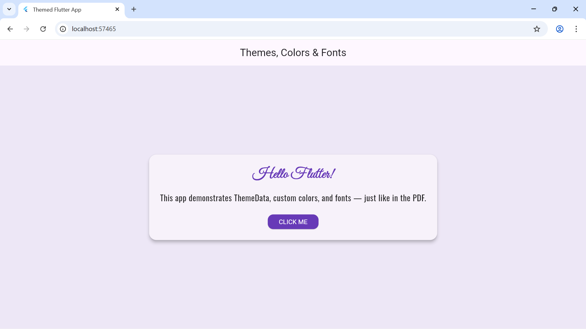

# Themed Flutter App

This Flutter app was created following the **Pertemuan 5 - Themes, Colors, and Fonts** instruction (UTB).  
It demonstrates the use of **ThemeData**, **Colors**, and **Custom Fonts** in a simple and consistent UI.

---

## 🎨 Features
- Custom theme using `ThemeData`
- Consistent color palette (`Colors.deepPurple`)
- Two custom fonts from [Google Fonts](https://fonts.google.com):
  - **Oswald** – used for headings
  - **Great Vibes** – used for accent or decorative text
- Clean, consistent layout following UI design principles
- Built and tested on Flutter SDK 3.x

---

## 🧰 How to Run

1. Clone this repository:
   ```bash
   git clone https://github.com/<yourusername>/testing_apk.git

## 🖼️ Screenshot


